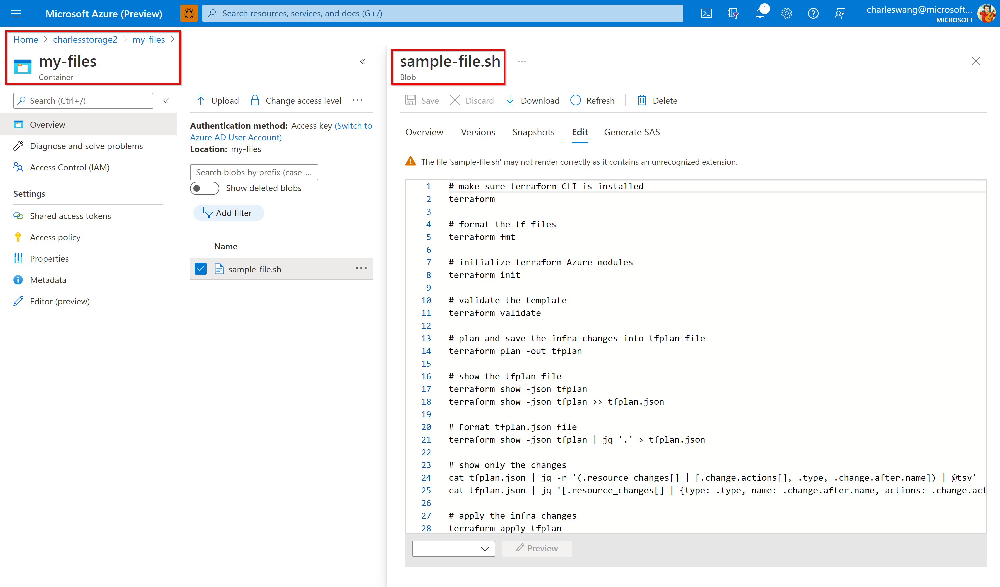

# azure-terraform

## Terraform Install

1. [https://www.terraform.io/downloads.html](https://www.terraform.io/downloads.html)

2. [https://learn.hashicorp.com/tutorials/terraform/install-cli](https://learn.hashicorp.com/tutorials/terraform/install-cli)

3. [https://docs.microsoft.com/en-us/azure/developer/terraform/get-started-windows-bash?tabs=bash](https://docs.microsoft.com/en-us/azure/developer/terraform/get-started-windows-bash?tabs=bash)

## Official Doc

1. [https://registry.terraform.io/providers/hashicorp/azurerm/latest/docs/resources/storage_account](https://registry.terraform.io/providers/hashicorp/azurerm/latest/docs/resources/storage_account)

2. [https://docs.microsoft.com/en-us/azure/developer/terraform/store-state-in-azure-storage?tabs=azure-cli](https://docs.microsoft.com/en-us/azure/developer/terraform/store-state-in-azure-storage?tabs=azure-cli)

3. [https://registry.terraform.io/providers/hashicorp/azurerm/latest/docs/resources/storage_management_policy](https://registry.terraform.io/providers/hashicorp/azurerm/latest/docs/resources/storage_management_policy)

## Tutorial: *Use Terraform to create an Azure storage account, with an container, then upload a file as a blob to the container, and create a public access to the blob.*

1. [https://www.youtube.com/watch?v=gQmVad3hSmM](https://www.youtube.com/watch?v=gQmVad3hSmM)

2. [https://github.com/HoussemDellai/terraform-course/tree/main/13_storage_blob](https://github.com/HoussemDellai/terraform-course/tree/main/13_storage_blob)

